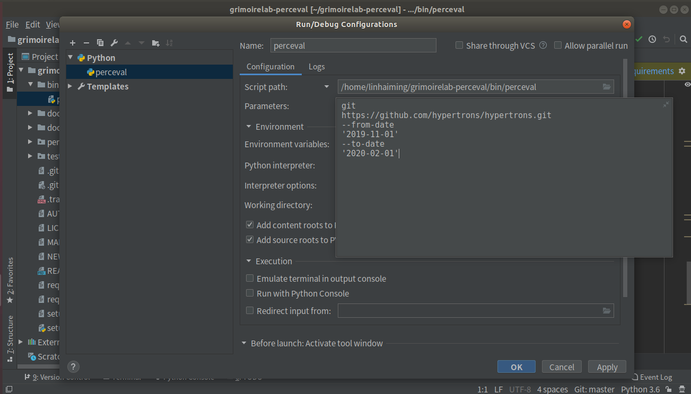

# Microtask 1
Set up Perceval to be executed from PyCharm.
## Steps
1. Download and install PyCharm IDE.
2. Clone grimoirelab-perceval repository.
3. Open the Perceval project in PyCharm IDE
4. Edit the Run/Debug configuration
    - Select `Script path` as `bin/perceval` from the project repository.
    - Add Perceval parameters in `Parameters` input tab.
    - Apply the changes and Run the script.
    
