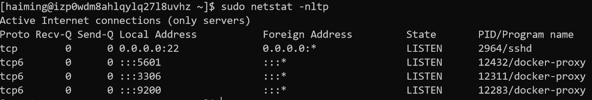

# Microtask 4
Set up a dev environment to work on GrimoireLab.

Here's the [Reference](https://github.com/chaoss/grimoirelab-sirmordred#setting-up-a-pycharm-dev-environment).

In this task, We will use the method of `docker-compose`to set up the GrimoireLab developer environment. It is really powerful and convenient.

All we need to do is configure a [`docker-compose.yml`](./docker-compose.yml). A version of `docker-compose` with SearchGuard may looks like: 

 ```docker-compose
elasticsearch:
  restart: on-failure:5
  image: bitergia/elasticsearch:6.1.0-secured
  command: elasticsearch -Enetwork.bind_host=0.0.0.0 -Ehttp.max_content_length=2000mb
  environment:
    - ES_JAVA_OPTS=-Xms2g -Xmx2g
  ports:
    - 9200:9200

kibiter:
  restart: on-failure:5
  image: bitergia/kibiter:secured-v6.1.4-5
  environment:
    - PROJECT_NAME=Development
    - NODE_OPTIONS=--max-old-space-size=1000
    - ELASTICSEARCH_URL=https://elasticsearch:9200
    - ELASTICSEARCH_USER=kibanaserver
    - ELASTICSEARCH_PASSWORD=kibanaserver
  links:
    - elasticsearch
  ports:
    - 5601:5601
    
mariadb:
  restart: on-failure:5
  image: mariadb:10.0
  expose:
    - "3306"
  ports:
    - "3306:3306"
  environment:
    - MYSQL_ROOT_PASSWORD=
    - MYSQL_ALLOW_EMPTY_PASSWORD=yes
    - MYSQL_DATABASE=test_sh
  command: --wait_timeout=2592000 --interactive_timeout=2592000 --max_connections=300
  log_driver: "json-file"
  log_opt:
      max-size: "100m"
      max-file: "3"
 ```   

Then run `docker-compose up -d` to get ElasticSearch, Kibiter and MariaDB.
```bash
docker-compose up -d
```

We can use `netstat` to show the ports:



