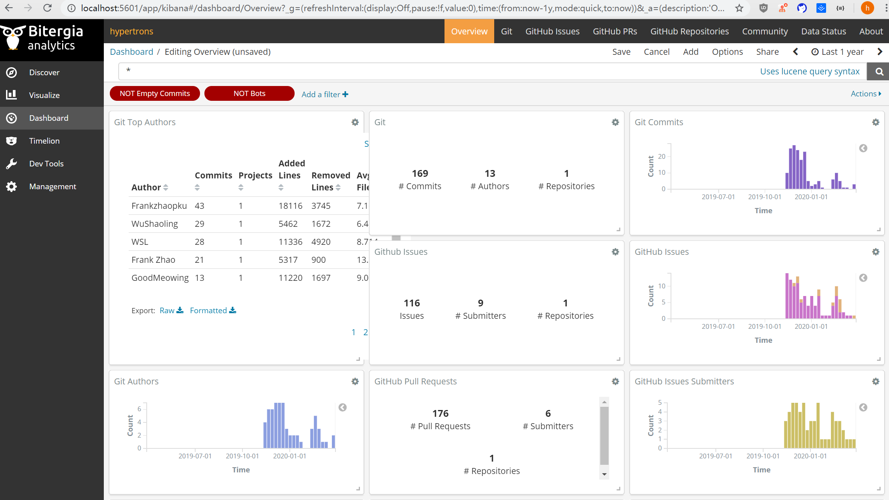

# Microtask 4
Execute micro-mordred to collect, enrich and visualize data from any GitHub repository.

Here's the [Reference](https://chaoss.github.io/grimoirelab-tutorial/sirmordred/micro-mordred.html).

Micro-Mordred is a simplified version of Mordred which omits the use of its scheduler. Thus, Micro-Mordred allows to run single Mordred tasks (e.g. raw collection, enrichment) per execution. We can find the implementation of micro-mordred located in `/utils` directory and it can be executed via command line.

## Steps

- Using `docker-compose` which is explanated in [microtask-4](../microtask-4) to setup the development environment, i.e ElasticSearch, Kibiter and MariaDB. 

- Preparing a virtualenv: 

  ```bash
  python3 -m venv ~/venvs/gl
  source ~/venvs/gl/bin/activate
  ```

- Installing tools in the virtual environment

  ```bash
  pip3 install --upgrade pip
  pip3 install --upgrade setuptools
  pip3 install --upgrade wheel 
  ```

- Installing all GrimoireLab modules at once

  ```bash
  pip3 install grimoirelab
  ```

> The steps above can be find [here](https://chaoss.github.io/grimoirelab-tutorial/basics/install.html).

- Executing the `micro.py` file with the parameters

  ```bash
  micro.py --raw --enrich --cfg ./setup.cfg --backends git
  ```
  It executes the raw and enrich tasks for the git cfg using the elasticsearch.

  ```bash
  micro.py --panels --cfg ./setup.cfg
  ```
  It executes the panels task to load the Sigils panels to Kibiter.


## Configurations files
- [projects.json](./projects.json)
- [setup.cfg](./setup.cfg)
- [aliases.json](./aliases.json)

## Result



