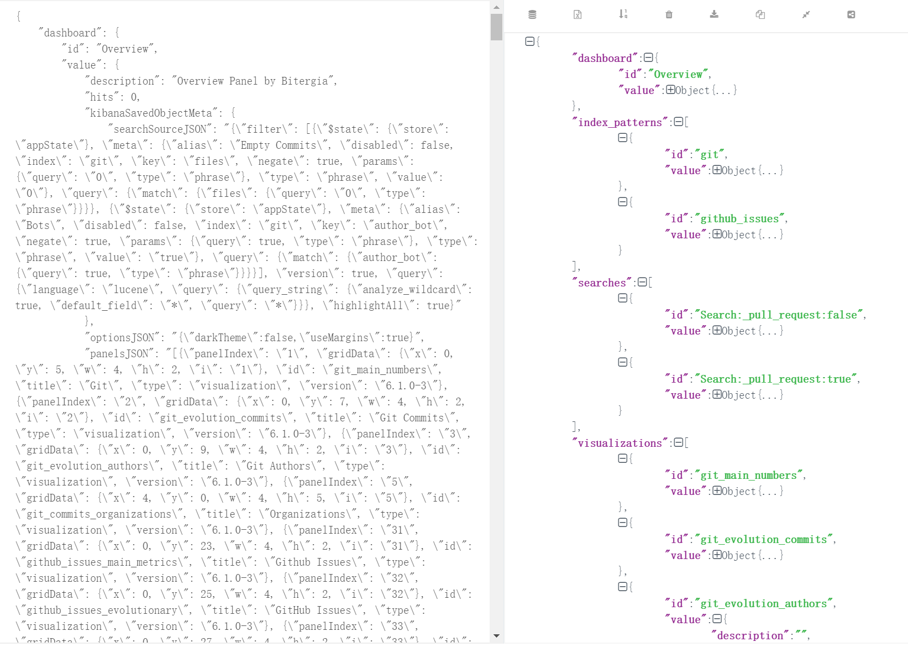

# Microtask 8
Set up Kidash and Archimedes to be executed from PyCharm. Export any dashboard available in your local Kibiter using Kidash and Archimedes.

---

## Kidash

Here is the [reference](https://github.com/chaoss/grimoirelab-kidash)

### Installation

- Using PyPi
  ```bash
  pip3 install kidash
  ```

- From Source code
  ```bash
  git clone https://github.com/chaoss/grimoirelab-kidash
  cd grimoirelab-kidash
  python3 setup.py install
  ```

### Usage

- Export a dashboard

```bash
kidash -g -e http://@localhost:9200 --dashboard Overview --export overview.json
```

The result can ref to [overview.json](./kidash/overview.json).




## Archimedes

Here is the [reference](https://github.com/Bitergia/archimedes)

### Installation

- From Source code
  ```bash
  git clone https://github.com/Bitergia/archimedes
  cd archimedes/
  python3 setup.py build
  python3 setup.py install
  ```

### Usage

- Export a visualization by ID and its index pattern

```bash
archimedes http://localhost:5601 /home --export --obj-type visualization --obj-id git_top_authors --force --index-pattern
```
The exported data was saved at `/home/visualizations/visualization_git_top_authors.json` and `/home/index-patterns/index-pattern_git.json`.

The result can ref to [archimedes](./archimedes).